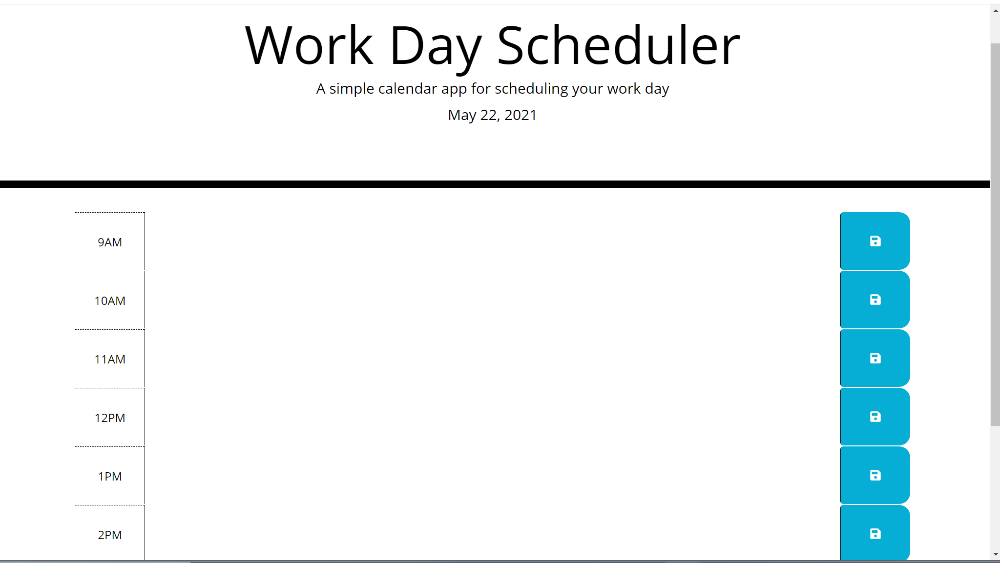

# dayPlanner

## Table of Contents
- [Overview](#overview)
- [Screenshot](#screenshot)
- [Deployed Link](#deployed-link)
- [Questions](#questions)

## Overview
Create a simple calendar application that allows a user to save events for each hour of the day by modifying starter code. This app will run in the browser and feature dynamically updated HTML and CSS powered by jQuery.

## Deployed Link
https://jamiekaczor.github.io/dayPlanner/

## Screenshot

## Questions
If you have any questions, please refer to my Github page, [JamieKaczor](https://github.com/JamieKaczor), or contact me through my email, Dignanjk@aol.com